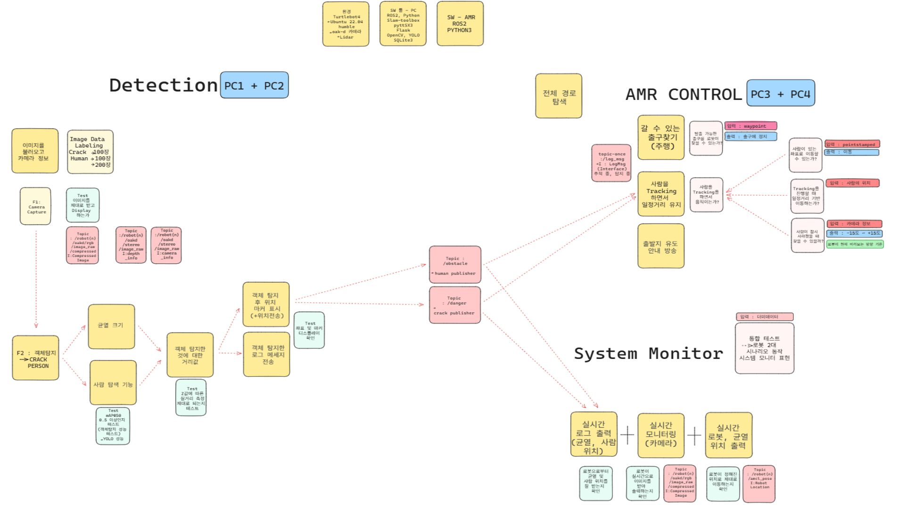
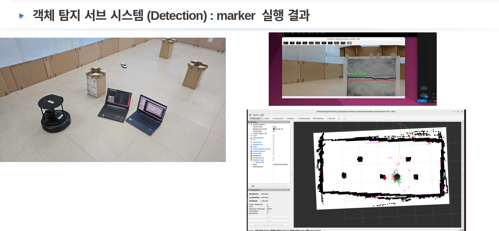

# 🧠 Multi-Robot Crack Detection & Human Guidance System

이 프로젝트는 TurtleBot4 기반의 협력 자율주행 로봇 시스템으로, 카메라 기반 객체 인식과 네비게이션을 통해 **위험(균열)을 감지**하고, **사람을 가장 가까운 안전한 출구로 유도**하는 기능을 수행합니다.


---

## 📂 시스템 구조 개요

| 파일 이름                       | 로봇  | 설명                                             |
| --------------------------- | --- | ---------------------------------------------- |
| `amr1.py`                   | 로봇1 | YOLO 기반 객체 인식 및 위험(crack) / 사람(car) 감지, 메시지 발행 |
| `robot6_through.py`         | 로봇1 | 미리 정의된 Waypoint 경로로 자율 주행                      |
| `just_go_to_car.py`         | 로봇1 | 사람(car) 감지 시 해당 위치로 이동 후 서비스 호출                |
| `amr2.py`                   | 로봇2 | 위험 발생 시 사람 위치 기반 출구 계산, YOLO 재탐지 시작            |
| `crack_tracking_inverse.py` | 로봇2 | 사람을 출구로 유도하고 따라오는지 판단하며 행동 결정                  |

---

## 🧠 전체 시나리오 설명 (Based on Python Node Files)

### 🔹 `amr1.py` – \[로봇 1: 균열 및 사람(car) 감지 노드]

* YOLO로 crack/car 인식 → 3D 좌표 계산
* crack 너비 >= 0.15m → `/danger` 발행
* car 감지 시 5초간 `/detected_human` 발행
* `/obstacle`, `/danger`, `/detected_human` 토픽 발행 담당
 
### 🔹 `robot6_through.py` – \[로봇 1: Waypoint 주행 전용 노드]

* TurtleBot4Navigator를 통해 다음 경로 순회:

  ```
  ```

1 → 1-1 → 2 → 2-1 → 3 → 4 → 7 → 6-6\`\`\`

* 균열 및 사람 감지는 하지 않음

### 🔹 `amr2.py` – \[로봇 2: 위험 판단 및 출구 계산 노드]

* `/danger` 감지 시 YOLO 기반 객체 감지 시작
* `/detected_human`에서 받은 car 위치로부터 exit4/exit5 중 가까운 출구 선택
* 유도 여부 자체는 별도 로직에서 수행됨

### 🔹 `just_go_to_car.py` – \[로봇 1: car 발견 시 이동 + 서비스 호출]

* `/obstacle`에서 car 감지 시 해당 위치로 이동
* 이동 성공 시 `/person_follow` 서비스 호출 → 로봇 2 유도 시작 트리거

### 🔹 `crack_tracking_inverse.py` – \[로봇 2: 사람 유도 및 행동 판단 FSM]

* `/person_follow` 요청 수신 시 유도 시작
* 현재 감지된 사람 위치 기준으로 가장 가까운 출구로 이동
* 사람이 일정 거리 이상 벌어지면 대기 또는 회귀
* 최종 도달 후 6-7 위치로 이동 후 도킹

---

## 🔁 전체 동작 흐름 요약

```
[amr1.py + robot6_through.py] 로봇1:
    → 웨이포인트 따라 이동하며 crack/car 감지
    → crack → /danger 발행
    → car → /detected_human 발행

↓ (감지 결과 전달)

[amr2.py] 로봇2:
    → danger_sense == 1.0 발생 시 YOLO 탐지 시작
    → 감지된 사람 위치 기준 출구 계산

[just_go_to_car.py]:
    → 로봇1이 car 위치로 이동 후 /person_follow 서비스 호출

[crack_tracking_inverse.py]:
    → 로봇2가 출구 방향으로 이동하며 사람이 따라오는지 판단 및 유도 수행
```

---

## 🧪 실행 방법

### 1. YOLO 모델 준비

```bash
/path/to/model/my_best.pt
```

### 2. 노드 실행 예시

```bash
# 로봇1: 객체 인식 + 주행
ros2 run your_pkg amr1.py
ros2 run your_pkg robot6_through.py

# 로봇1: car 감지 후 이동
ros2 run your_pkg just_go_to_car.py

# 로봇2: 위험 감지 및 출구 계산
ros2 run your_pkg amr2.py

# 로봇2: 사람 유도 및 상태 판단
ros2 run your_pkg crack_tracking_inverse.py
```

---

## 📡 주요 토픽 및 서비스 요약

### Publish Topics

* `/obstacle` : car, crack의 좌표 및 거리
* `/danger` : 균열 위험 정보
* `/detected_human` : car(사람) 위치 정보

### Services

* `/person_follow` : car 탐지 완료 후 유도 요청
* `/reperson_follow` : 사람 놓쳤을 때 재요청

---

